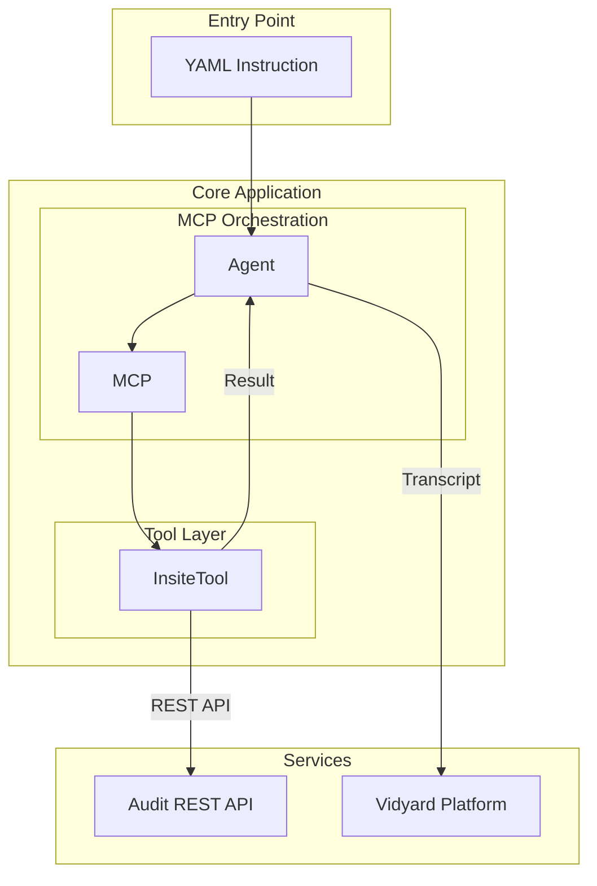
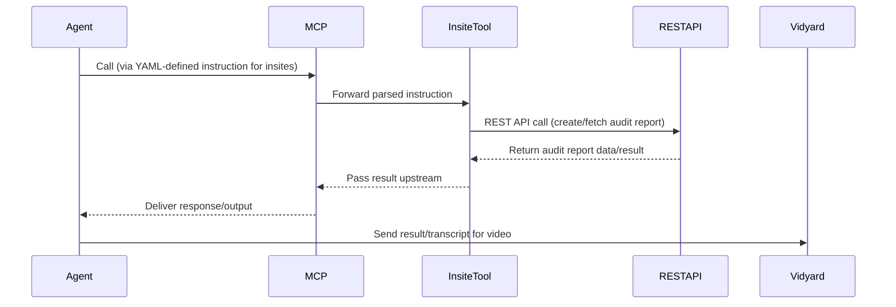

## MCP Audit Report Tool Architecture
This documentation provides a high-level explanation of an audit report creation and retrieval tool. It is built with the Model Context Protocol (MCP), using YAML‑driven orchestration, an Insite REST tool, and a backend Audit API.

## 📃 Table of Contents
- [✨ Architecture Overview](#-features)
- [🏗️ Architecture & Workflow](#%EF%B8%8F-architecture--workflow)
  - [🛠️ System Architecture](#%EF%B8%8F-system-architecture)
  - [🛠️ Workflow](#-workflow)


## Architecture Overview
Purpose:
To create and fetch audit reports through a modular, layered system where the Agent, MCP, Insite tool, and REST API interact via clearly separated responsibilities.


## 🏗️ Architecture & Workflow

### 🛠️ System Architecture

The system follows a modular architecture with clear separation of concerns:



### 📋 Workflow



## 🚀 Quick Start

### Prerequisites

#### System Requirements
- Python 3.9 or higher
- Git
- pip (Python package manager)

#### API Access
- **Salesforce**
  - Salesforce Developer/Production org with API access enabled
  - Connected App with OAuth2 credentials (Client ID and Client Secret)
  - JWT Bearer Flow enabled in Salesforce Connected App settings
  - User with appropriate permissions (API Enabled, Manage Users, and other required permissions)
  - Private key and certificate for JWT authentication

- **Google Cloud Platform**
  - Google Cloud Project with Google Drive API enabled
  - OAuth 2.0 Client ID credentials
  - Service account credentials file (JSON)

- **OpenAI**
  - OpenAI API key with access to GPT models
  - Sufficient credits/balance for API usage

#### Required Files
- Private key file for Salesforce JWT authentication
- Google service account credentials JSON file
- `.env` file with all necessary configurations

### Installation

1. Clone the repository:
   ```bash
   git clone https://github.com/SoumyabrataNandi/AutoGenAIProject.git
   cd AutoGenAIProject/autogen_sdr_automation
   ```

2. Create and activate a virtual environment:
   ```bash
   # Windows
   python -m venv venv
   .\venv\Scripts\activate
   
   # macOS/Linux
   python3 -m venv venv
   source venv/bin/activate
   ```

3. Install the package in development mode:
   ```bash
   pip install -e ".[dev]"
   ```

## ⚙️ Configuration

1. Copy the example environment file:
   ```bash
   cp .env.example .env
   ```

2. Edit the `.env` file with your credentials:
   ```ini
   # Salesforce JWT Authentication
   # Required: Client ID from your Connected App in Salesforce
   SALESFORCE_CLIENT_ID=your_connected_app_client_id
   SALESFORCE_CLIENT_SECRET=your_connected_app_client_secret
   
   # Required: Username to authenticate as
   SALESFORCE_USERNAME=your_username@example.com

   # Required: Base URL of your Salesforce instance (e.g., https://yourdomain.my.salesforce.com)
   SALESFORCE_BASE_URL=https://test.salesforce.com  # Use https://login.salesforce.com for production
   PRIVATE_KEY=Private_Key/server.key  # Path to your private key file for JWT authentication

   # Token URL for JWT authentication
   SALESFORCE_TOKEN_URL="https://test.salesforce.com/services/oauth2/token"

   # Google Drive Integration
   DRIVE_SCOPES='https://www.googleapis.com/auth/drive.metadata.readonly'
   DRIVE_CREDENTIALS_FILE=Private_Key/credentials.json
   PDF_DOWNLOAD_URL="https://www.googleapis.com/drive/v3/files/{file_id}?alt=media"

   # Email settings
   SMTP_SERVER=smtp.gmail.com
   SMTP_PORT=587
   SMTP_USERNAME=your_email@gmail.com
   SMTP_PASSWORD="your_app_password"
   DEFAULT_FROM_EMAIL=your_email@gmail.com
   DEFAULT_FROM_NAME="Your Name"
   USE_TLS=true

   # AutoGen Configuration
   # Comma-separated list of available models (e.g., gpt-4,gpt-3.5-turbo)
   AUTOGEN_MODELS=["gpt-4", "gpt-3.5-turbo"]

   # OpenAI API Key (same key for all models)
   OPENAI_API_KEY=your_openai_api_key

   # Default model to use
   DEFAULT_MODEL=gpt-4

   # Request timeout in seconds
   REQUEST_TIMEOUT=120
   ```

# AutoGen Configuration

    ```
    OPENAI_API_KEY=your_openai_api_key  # Required: Your OpenAI API key
    AUTOGEN_MODELS=["gpt-4", "gpt-3.5-turbo"]  # Available models for AutoGen
    DEFAULT_MODEL=gpt-4  # Default model to use for completions
    REQUEST_TIMEOUT=600  # Request timeout in seconds
    LLM_TEMPERATURE=0.7  # Controls randomness (0.0 to 1.0)
    LLM_MAX_TOKENS=4000  # Maximum number of tokens to generate
    LLM_SEED=42  # Optional: Set a random seed for reproducible outputs

    ```

## 🛠️ Usage

### Running the Autonomous Agent

#### Command Line Interface (CLI)

```bash
# Initialize and start an interactive chat session
autogen_sdr_automation chat

# Execute a task using natural language
autogen_sdr_automation task "Find all high-priority accounts created this month"
```

#### Python API

```python
from autogen_sdr_automation.cli import AutoGenSDRAgentCLI

# Initialize the CLI interface
cli = AutoGenSDRAgentCLI()

# Initialize all agents
cli.initialize_agents()

# Have a conversation with the AI agent
cli.chat("Show me all open opportunities over $50,000")

# Execute a SOQL query directly
results = cli.run_query("SELECT Id, Name, Amount FROM Opportunity WHERE IsClosed = False AND Amount > 50000")
print(results)

# Execute a complex task using natural language
task_result = cli.execute_task(
    "Find all contacts from companies in the technology sector "
    "and create a summary report of their email domains"
)
print(task_result)
```

#### Configuration Options

When initializing the agent, you can override default settings through environment variables or directly in code:

```python
from autogen_sdr_automation.cli import AutoGenSDRAgentCLI

# Initialize with custom configuration
cli = AutoGenSDRAgentCLI()
cli.initialize_agents(
    default_model="gpt-4",  # Override default model
    temperature=0.7,        # Control creativity (0.0 to 1.0)
    max_tokens=2000,       # Limit response length
    request_timeout=120     # API timeout in seconds
)
```

### Advanced Task Automation

The agent can autonomously execute complex tasks using natural language. Here are some examples:

```python
# Execute a sales analysis task
task_result = cli.execute_task(
    "Analyze opportunities closed this quarter. "
    "Group by sales rep and stage, then calculate average deal size."
)

# Generate a lead qualification report
report = cli.execute_task(
    "Create a report of all leads created in the last 7 days. "
    "Categorize them by industry and lead source, "
    "and prioritize based on lead score and company size."
)

# Automate data cleanup
action = cli.execute_task(
    "Find all duplicate contacts with the same email address. "
    "Keep the most recently modified record and merge the others."
)
```

### Task Monitoring and Error Handling

```python
try:
    # Execute a task with error handling
    result = cli.execute_task(
        "Update all contact records missing a phone number "
        "with the company's main phone number"
    )
    
    if result.success:
        print(f"Task completed successfully. {result.records_processed} records updated.")
    else:
        print(f"Task completed with warnings: {result.warnings}")
        
except Exception as e:
    print(f"Error executing task: {str(e)}")
    # Access detailed error information
    if hasattr(e, 'response'):
        print(f"API Response: {e.response.text}")
```

### Available Agent Functions

The autonomous agent provides the following core capabilities:

#### Salesforce Operations
- `query(soql: str, model: Type[T]) -> QueryResult[T]`: Execute SOQL queries with typed results
- `get_metadata(object_name: str) -> Dict[str, Any]`: Retrieve metadata for a Salesforce object
- `get_available_objects() -> List[str]`: List all available Salesforce objects
- `get_object_fields(object_name: str) -> Dict[str, Any]`: Get field metadata for an object
- `get_record(object_name: str, record_id: str) -> Dict[str, Any]`: Retrieve a specific record
- `create_record(object_name: str, data: Dict[str, Any]) -> Dict[str, Any]`: Create a new record
- `update_record(object_name: str, record_id: str, data: Dict[str, Any]) -> bool`: Update an existing record
- `delete_record(object_name: str, record_id: str) -> bool`: Delete a record

#### Google Drive Integration
- `list_drive_files(query: str = None) -> List[Dict[str, Any]]`: List files from Google Drive
- `search_drive_files(query: str) -> List[Dict[str, Any]]`: Search for files in Google Drive

#### AI-Powered Features
- `execute_task(task_description: str) -> Any`: Execute complex tasks using natural language
- `chat(message: str) -> str`: Have a conversation with the AI agent

# 📦 Project Structure

```
autogen_sdr_automation/
├── Private Key/
│       ├── credentials.json            # Drive credential
│       └── server.key                  # Salesforce server key
├── docs/
│     ├── architecture.png             # Architecture diagram
│     └── workflow.png                 # Workflow diagram
├── src/
│   └── autogen_sdr_automation/
│       ├── __init__.py
│       ├── cli.py                       # Command-line interface
│       ├── config/
│       │   ├── __init__.py
│       │   └── settings.py              # Configuration settings
│       ├── models/
│       │   ├── __init__.py
│       │   ├── base.py                  # Base models
│       │   ├── client.py                # Client implementation
│       │   └── salesforce/ 
│       │       ├── __init__.py          # Salesforce specific models
│       │       └── account.py
│       ├── prompts/                     # Prompt templates
│       │   ├── __init__.py
│       │   ├── summarization_prompts.py
│       │   └── email_prompts.py
│       ├── agents/                       # Agents
│       │   ├── __init__.py
│       │   ├── summarization_agent.py
│       │   └── email_generation_agent.py
│       ├── services/
│       │   ├── __init__.py
│       │   ├── base_service.py           # Base service class
│       │   ├── salesforce_service.py     # Salesforce service implementation
│       │   └── googledrive_service.py    # Google Drive service
│       └── utils/
│           ├── __init__.py
│           ├── document_helpers.py       # Document processing helpers
│           ├── exceptions.py             # Custom exceptions
│           └── helper.py                 # Helper functions
├── .env.example                          # Example environment variables
├── requirements.txt                      # Project dependencies
├── pyproject.toml                        # Project metadata and build configuration
├── setup.py                              # Project setup script
└── README.md                             # This file
```

# Salesforce API Credentials (Required)
SF_USERNAME=your_username@example.com
SF_PASSWORD=your_password
SF_SECURITY_TOKEN=your_security_token  # Required for sandbox environments
SF_DOMAIN=test  # 'test' for sandbox, 'login' for production
SALESFORCE_BASE_URL=https://test.salesforce.com  # Use https://login.salesforce.com for production
PRIVATE_KEY=Private_Key/server.key  # Path to your private key file for JWT authentication

# OAuth2 Configuration (Required for JWT Bearer Flow)
SALESFORCE_CLIENT_ID=your_connected_app_client_id
SALESFORCE_TOKEN_URL=https://test.salesforce.com/services/oauth2/token  # Use https://login.salesforce.com for production

# Google Drive Integration
DRIVE_SCOPES='https://www.googleapis.com/auth/drive.metadata.readonly'
DRIVE_CREDENTIALS_FILE=Private_Key/credentials.json  # Path to your Google OAuth2 credentials file
PDF_DOWNLOAD_URL="https://www.googleapis.com/drive/v3/files/{file_id}?alt=media"
DRIVE_BEST_PRACTICE_DOC=your_best_practice_folder_name

# AutoGen Configuration (Required)
OPENAI_API_KEY=your_openai_api_key
AUTOGEN_MODELS=["gpt-4", "gpt-3.5-turbo"]  # Available models for AutoGen
DEFAULT_MODEL=gpt-4  # or gpt-3.5-turbo
REQUEST_TIMEOUT=600  # seconds
   ```

   > **Note**: To get your Salesforce security token, log in to Salesforce, go to Settings > My Personal Information > Reset My Security Token, and click 'Reset Security Token'.
   
```

# Email Configuration (Not Recommended Using SMTP try to use SendGrid or GraphAPI or any other Email Service)
    SMTP_SERVER=smtp.gmail.com
    SMTP_PORT=587
    SMTP_USERNAME=your_email@gmail.com
    SMTP_PASSWORD="your_app_password"
    DEFAULT_FROM_EMAIL=your_email@gmail.com
    DEFAULT_FROM_NAME="Your Name"
    USE_TLS=true

## 🎯 Command Line Interface

The AutoGen Salesforce Agent provides a powerful command-line interface for interacting with Salesforce using natural language.

### Basic Commands

```bash
# Start an interactive chat session
autogen_sdr_automation chat

# Execute a single command
autogen_sdr_automation chat "Show me all open opportunities"

# Execute a complex task
autogen_sdr_automation task "Analyze sales pipeline and identify at-risk opportunities"

# Get help and see all available commands
autogen_sdr_automation --help
```

### Advanced Usage

```bash
# Specify a different model
autogen_sdr_automation --model gpt-4 chat "Generate a detailed sales report"

# Set temperature for more/less creative responses
autogen_sdr_automation --temperature 0.2 chat "Write a professional email"

# Save conversation to a file
autogen_sdr_automation chat --output conversation.log
```

## 🐍 Python API

For more advanced integration, you can use the Python API directly:

### Basic Setup

```python
from autogen_sdr_automation.cli import AutoGenSDRAgentCLI

# Initialize with default settings from environment variables
cli = AutoGenSDRAgentCLI()
cli.initialize_agents()

# Or customize settings
cli.initialize_agents(
    default_model="gpt-4",
    temperature=0.7,
    max_tokens=2000
)
```

### Common Operations

```python
# Have a conversation
response = cli.chat("Show me all high-value opportunities")
print(response)

# Execute a SOQL query
results = cli.run_query(
    "SELECT Id, Name, Amount, CloseDate "
    "FROM Opportunity "
    "WHERE IsClosed = False AND Amount > 50000"
)

# Process complex tasks
task_result = cli.execute_task(
    "Analyze our sales pipeline for the current quarter. "
    "Identify any deals at risk of missing their close date "
    "and suggest actions to move them forward."
)
```

### Error Handling

```python
try:
    result = cli.execute_task("Update all contacts with missing information")
    if result.success:
        print(f"Success! {result.records_processed} records updated.")
    else:
        print(f"Task completed with warnings: {result.warnings}")
except Exception as e:
    print(f"Error: {str(e)}")
    if hasattr(e, 'response'):
        print(f"API Response: {e.response.text}")
```

## Development

### Running Tests

```bash
pytest
```

### Code Formatting

```bash
black .
isort .
```

### Type Checking

```bash
mypy .
```

### Linting

```bash
flake8 .
```

# 🙏 Acknowledgments

- [AutoGen](https://microsoft.github.io/autogen/) - For the multi-agent conversation framework
- [Simple Salesforce](https://github.com/simple-salesforce/simple-salesforce) - For the Salesforce API client
- [OpenAI](https://openai.com) - For the powerful language models


# 📜 License

This project is licensed under the MIT License - see the [LICENSE](LICENSE) file for details.

```
MIT License

Copyright (c) 2025 Soumyabrata Nandi

Permission is hereby granted, free of charge, to any person obtaining a copy
of this software and associated documentation files (the "Software"), to deal
in the Software without restriction, including without limitation the rights
to use, copy, modify, merge, publish, distribute, sublicense, and/or sell
copies of the Software, and to permit persons to whom the Software is
furnished to do so, subject to the following conditions:

The above copyright notice and this permission notice shall be included in all
copies or substantial portions of the Software.

THE SOFTWARE IS PROVIDED "AS IS", WITHOUT WARRANTY OF ANY KIND, EXPRESS OR
IMPLIED, INCLUDING BUT NOT LIMITED TO THE WARRANTIES OF MERCHANTABILITY,
FITNESS FOR A PARTICULAR PURPOSE AND NONINFRINGEMENT. IN NO EVENT SHALL THE
AUTHORS OR COPYRIGHT HOLDERS BE LIABLE FOR ANY CLAIM, DAMAGES OR OTHER
LIABILITY, WHETHER IN AN ACTION OF CONTRACT, TORT OR OTHERWISE, ARISING FROM,
OUT OF OR IN CONNECTION WITH THE SOFTWARE OR THE USE OR OTHER DEALINGS IN THE
SOFTWARE.
```

### Third-Party Licenses

This project includes third-party open source software components. For details about the licenses of these components, please see the [NOTICE](NOTICE) file.


# 🤝 Contributing

Contributions are welcome! Please follow these steps:

1. Fork the repository
2. Create a feature branch (`git checkout -b feature/AmazingFeature`)
3. Commit your changes (`git commit -m 'Add some AmazingFeature'`)
4. Push to the branch (`git push origin feature/AmazingFeature`)
5. Open a Pull Request
