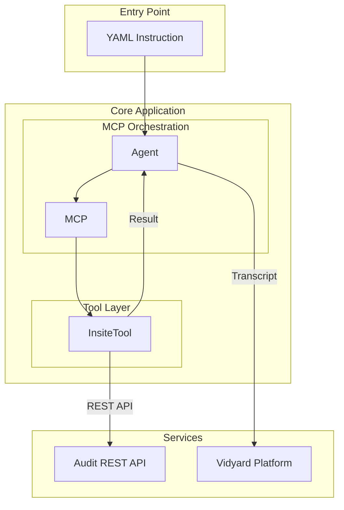
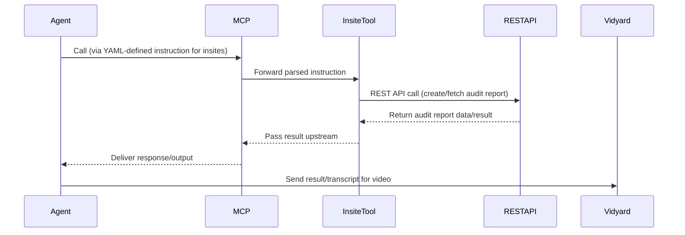

## MCP Audit Report Tool Architecture
This documentation provides a high-level explanation of an audit report creation and retrieval tool. It is built with the Model Context Protocol (MCP), using YAML‑driven orchestration, an Insite REST tool, and a backend Audit API.

## 📃 Table of Contents
- [✨ Architecture Overview](#-features)
- [🏗️ Architecture & Workflow](#%EF%B8%8F-architecture--workflow)
  - [🛠️ System Architecture](#%EF%B8%8F-system-architecture)
  - [🛠️ Workflow](#-workflow)

## Architecture Overview
This documentation outlines the high-level architecture for a tool built using the Model Context Protocol (MCP) that        creates and fetches audit reports via an insite tool and REST API calls.

## System Architecture Diagram
The system is composed of the following primary components:
   -Agent Layer: Executes instructions defined in YAML to drive audit report actions.

   -MCP Interface: Receives instructions from the agent and coordinates interactions.  
   
   -Insite Tool Service: Acts as an intermediary, executing tasks upon request from the MCP. 
   
   -REST API Backend: Provides endpoints to create and retrieve audit reports, ultimately interfacing with the database or      reporting system.

## 🏗️ Architecture & Workflow

### 🛠️ System Architecture

The system follows a modular architecture with clear separation of concerns:

### 📋 Workflow

## 🚀 Quick Start

### Prerequisites

#### System Requirements
- Python 3.9 or higher
- Git
- pip (Python package manager)

#### API Access
-API Access
  -Audit REST API
    -Access to the backend Audit REST API endpoint (URL, credentials/tokens as required)
   -User or service account with permission to create/fetch audit reports

 -Insite Tool
    -Local or remote deployment configuration for the Insite Tool Python/Node.js service
    -Network access so the Insite Tool can reach the Audit REST API
